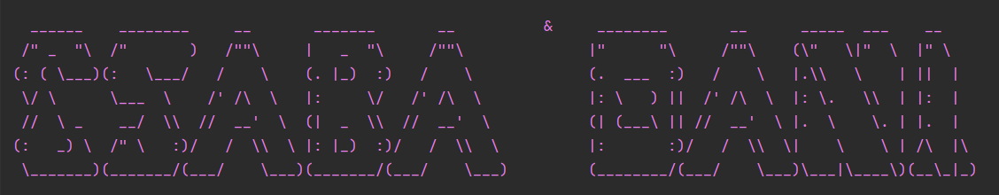

# ChillMate Team - chill-mate app

## 📊 Project Summary

In this application, users and their interests are represented within a **graph structure**. Both **users** and **interests** are modeled as **nodes**, and their connections are displayed as **edges** between them.

### 🔗 One-Way Relationships

These relationships originate from the user and point toward an interest:

- **Residence:** `LIVES_IN`
- **Hobby:** `LIKES_HOBBY`
- **Sport:** `PLAYS_SPORT`
- **Music Genre:** `LIKES_MUSIC`
- **Movie:** `LIKES_MOVIE`
- **Event (they would like to attend):** `WANTS_TO_ATTEND`

> These connections always start from a person and point to an area of interest.

### 🔄 Two-Way Relationship

This relationship represents mutual connections between users:

- **Friendship/Acquaintance:** `IS_FRIEND_WITH`

> This is a bidirectional relationship — if one person is a friend of another, the reverse is also true.

---

## 🛠️ Tech Stack

### Backend (Spring Boot / Java)

- **Language**: Java 21
- Spring Boot 3.4.3
- Spring Web
- Spring Data Neo4j
- Lombok
- ModelMapper
- Maven

### Frontend (React / JavaScript)

- **Language**: JavaScript (ES6+)
- React 19
- React Router DOM
- React Flow
- Axios
- React Modal
- Jest + React Testing Library

### Database

- **Neo4j** (via Spring Data Neo4j)

---

## 🧑‍💻 Developers

- [**Csaba Vadasz**](https://github.com/Csaba79-coder) — csabavadasz79@gmail.com  
- [**Daniel Pocz-Nagy**](https://github.com/poczdani) — pocz.dani@gmail.com

---

